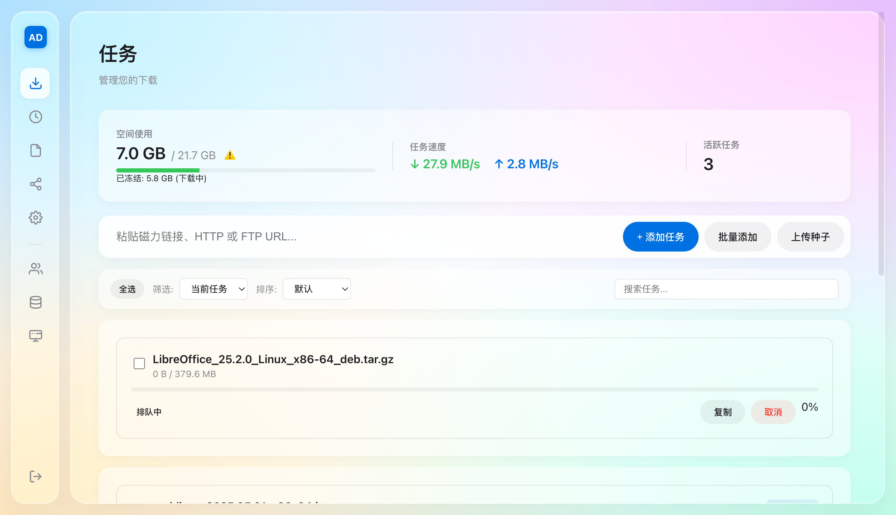
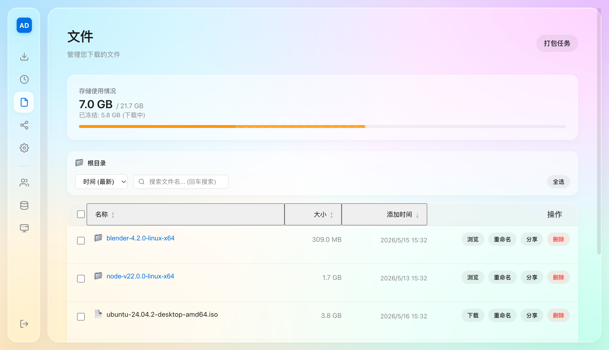
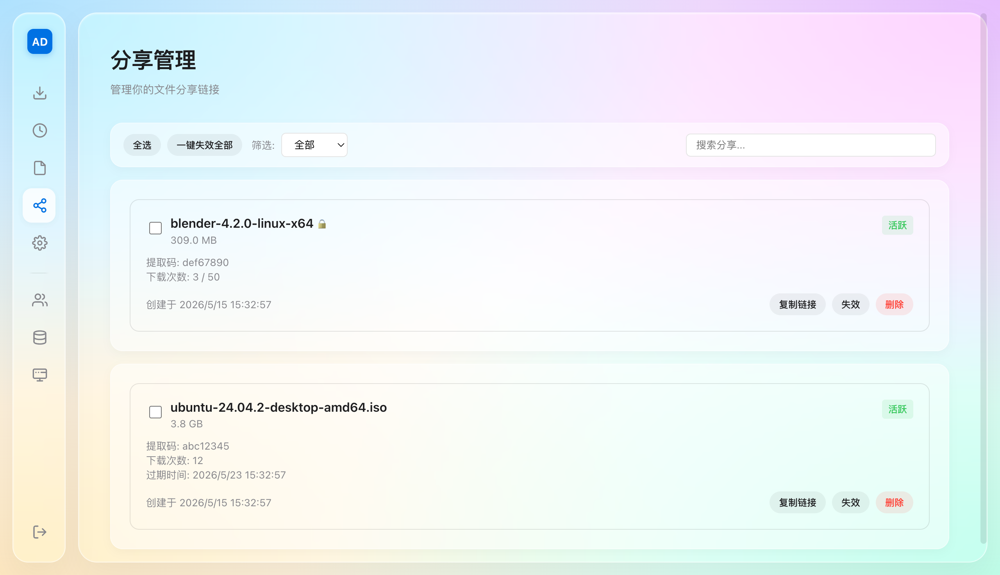
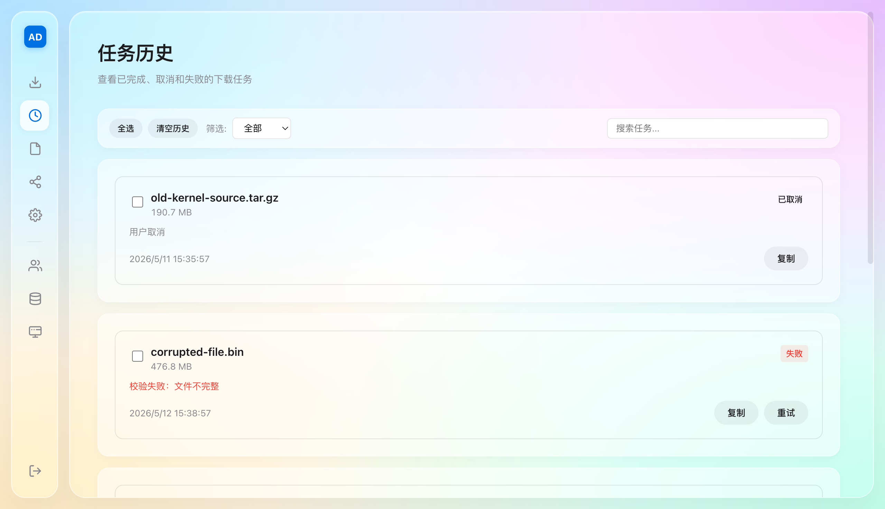

<div align="center">

# Aria2Deck

**基于 aria2 的多用户下载管理平台**

一套 Web 界面搞定：添加任务、管理文件、多人协作、分享下载

[](LICENSE)
[](https://github.com/crmmc/aria2deck/pkgs/container/aria2deck)

</div>

<br>

## 功能亮点

**下载管理** — 支持磁力链接、种子文件、HTTP/FTP，可批量添加。BT 种子支持选择性下载（预览文件列表，勾选需要的文件）。WebSocket 实时推送状态，任务完成/失败桌面通知提醒。

**文件管理** — 在线浏览、重命名、下载、删除。多文件打包下载（ZIP / TAR.ZST），支持目录结构浏览。

**文件分享** — 生成分享链接，支持密码保护、过期时间、下载次数限制，随时可撤销。

**存储管理** — 管理员可查看全局存储用量，按用户统计空间占用，配额管理一目了然。

**多用户隔离** — 每用户独立任务列表和文件空间，管理员可分配配额。同一资源多人下载时自动复用，节省带宽。

**任务历史** — 完整记录下载任务的完成、取消、失败状态，支持一键重试和批量清理。

**外部客户端** — 兼容 aria2 RPC 协议，可对接 AriaNg、Motrix 等客户端，每用户独立 RPC Secret。

<br>

## 界面预览

<table>
  <tr>
    <td align="center"><br><sub>任务管理</sub></td>
    <td align="center"><br><sub>文件管理</sub></td>
  </tr>
  <tr>
    <td align="center"><br><sub>分享管理</sub></td>
    <td align="center"><br><sub>任务历史</sub></td>
  </tr>
</table>

<br>

## 快速开始

### Docker Compose（推荐）

```bash
git clone https://github.com/crmmc/aria2deck.git
cd aria2deck
export ARIA2_RPC_SECRET="$(openssl rand -hex 32)"
export ARIA2DECK_SHARE_JWT_SECRET="$(openssl rand -hex 32)"
read -rsp "初始管理员密码（至少 16 个字符）: " ARIA2DECK_INITIAL_ADMIN_PASSWORD
export ARIA2DECK_INITIAL_ADMIN_PASSWORD
printf '\n'
make docker-up
```

浏览器打开 `http://localhost:8001`，使用账号 `admin` 和上面设置的初始密码登录。已有管理员的升级部署可不设置 `ARIA2DECK_INITIAL_ADMIN_PASSWORD`。

### 独立 Docker 运行

先按上文设置三个 secret 环境变量；已有管理员时可省略 `ARIA2DECK_INITIAL_ADMIN_PASSWORD`。

```bash
docker run -d \
  --name aria2deck \
  --network host \
  -e ARIA2C_HOST=127.0.0.1 \
  -e ARIA2C_ARIA2_RPC_SECRET="$ARIA2_RPC_SECRET" \
  -e ARIA2DECK_SHARE_JWT_SECRET \
  -e ARIA2DECK_INITIAL_ADMIN_PASSWORD \
  -e ARIA2C_DOWNLOAD_DIR=/Downloads/aria2deck \
  -v /your/data:/app/backend/data \
  -v /Downloads/aria2deck:/Downloads/aria2deck \
  ghcr.io/crmmc/aria2deck:<tag>
```

<br>

## 使用流程

1. 管理员使用配置的初始密码登录并修改密码
2. 粘贴下载链接、上传种子文件（可选择性下载部分文件）或添加磁力链接
3. 下载完成后，在文件页面浏览和管理
4. 需要多人使用时，在用户管理创建新账号
5. 需要分享文件时，生成分享链接发给对方

<br>

## 技术栈

| 层 | 技术 |
|----|------|
| 后端 | FastAPI + SQLModel + aiohttp |
| 前端 | Next.js 14 + TypeScript |
| 数据库 | SQLite |
| 下载引擎 | aria2 (JSON-RPC) |
| 部署 | Docker |

<br>

<details>
<summary><strong>环境变量</strong></summary>

| 变量 | 说明 | 默认值 |
|------|------|--------|
| `ARIA2C_ARIA2_RPC_URL` | aria2 RPC 地址 | `http://localhost:6800/jsonrpc` |
| `ARIA2C_ARIA2_RPC_SECRET` | aria2 RPC 密钥 | - |
| `ARIA2C_DOWNLOAD_DIR` | 下载文件存放目录 | `/app/backend/downloads` |
| `ARIA2C_DATABASE_PATH` | 数据库文件路径 | `./data/app.db` |
| `ARIA2C_SESSION_TTL_SECONDS` | 登录会话有效期（秒） | `43200` |
| `ARIA2C_ARIA2_POLL_INTERVAL` | aria2 状态轮询间隔（秒） | `2.0` |
| `ARIA2DECK_SHARE_JWT_SECRET` | 分享链接签名密钥，非 debug 模式必填 | - |
| `ARIA2DECK_INITIAL_ADMIN_PASSWORD` | 首次创建管理员时使用，至少 16 个字符 | - |
| `ARIA2C_EXTRA_CORS_ORIGINS` | 额外允许的 CORS 域名 | - |

</details>

<details>
<summary><strong>数据持久化</strong></summary>

Docker 部署时需要挂载两个目录：

| 容器路径 | 说明 |
|---------|------|
| `/app/backend/data` | 数据库文件，**必须备份** |
| `/app/backend/downloads` | 下载文件存放 |

</details>

<details>
<summary><strong>安全建议</strong></summary>

- 使用强随机的 `ARIA2C_ARIA2_RPC_SECRET` 和 `ARIA2DECK_SHARE_JWT_SECRET`
- Compose 默认仅在 `127.0.0.1:8001` 提供 Web 服务，且不会向宿主机发布 aria2 RPC 6800
- 远程访问必须使用提供 TLS 的反向代理；客户端 PBKDF2 结果仍是可重放的密码等价物，不能替代传输加密
- 定期备份 `data/` 目录

</details>

<details>
<summary><strong>本地开发</strong></summary>

```bash
# 安装依赖
make install

# 配置环境变量
cp backend/env.example backend/.env

# 三个终端分别启动
make dev-aria2    # aria2 后端
read -rsp "开发管理员密码（至少 16 个字符）: " ARIA2DECK_INITIAL_ADMIN_PASSWORD
export ARIA2DECK_INITIAL_ADMIN_PASSWORD
make dev-back     # API 后端（开发模式，按配置重置 admin 密码）
make dev-front    # 前端开发服务器（http://localhost:3000）
```

开发态页面路径统一使用无后缀路由，例如 `http://localhost:3000/tasks`、`/files`、`/shares`、`/history`、`/storage`、`/settings`。

</details>

<br>

## 许可协议

[MIT License](LICENSE)
